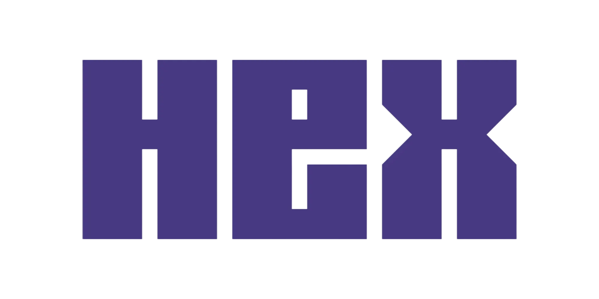
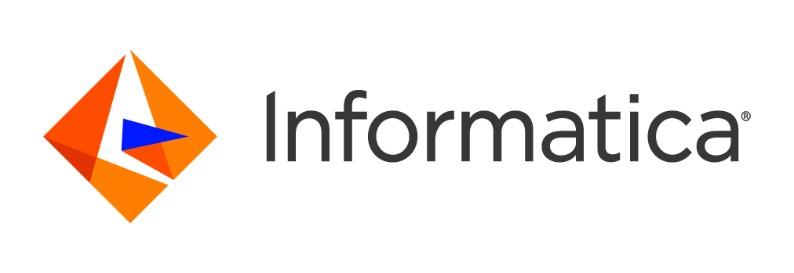
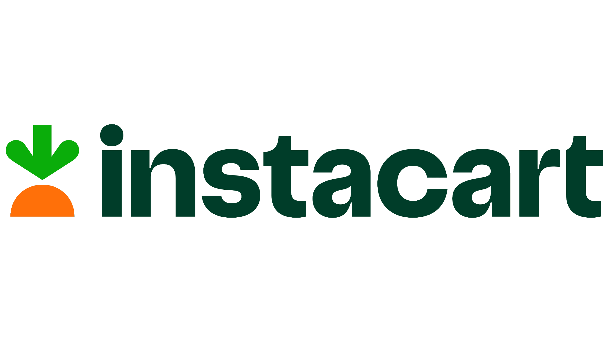
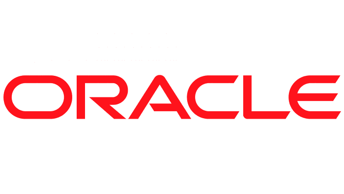
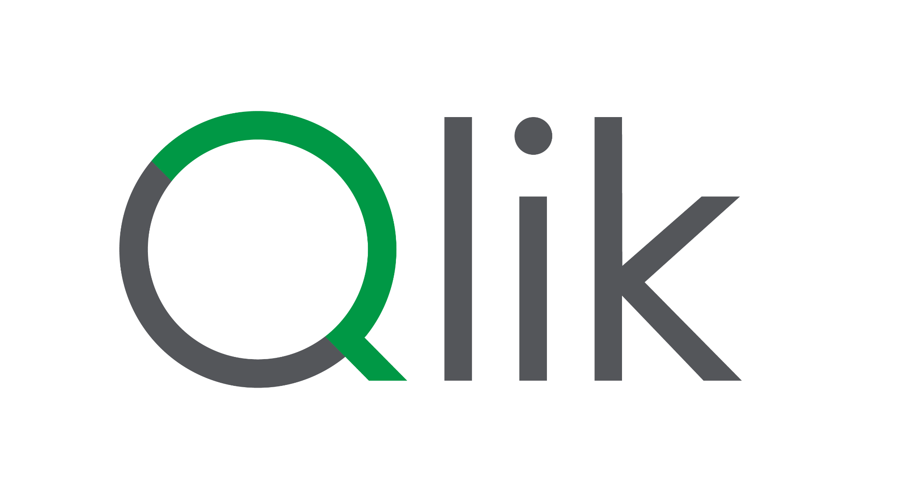
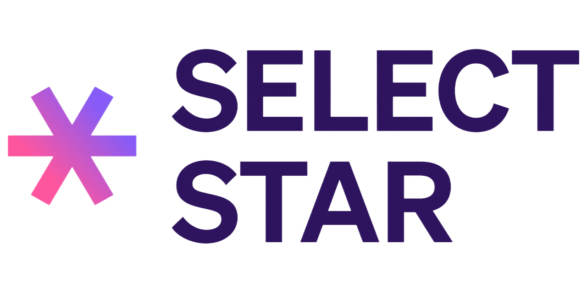
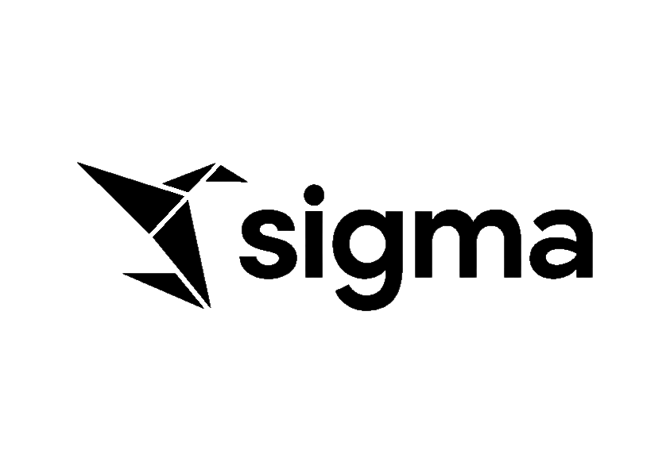
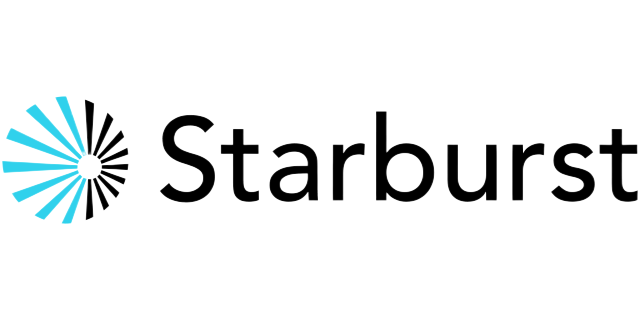
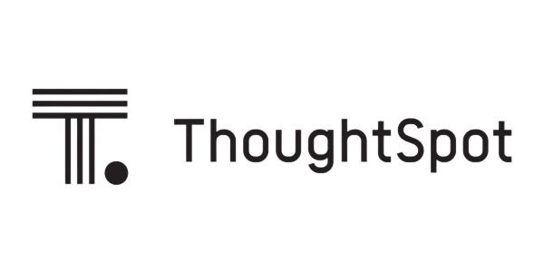

---
hide:
  - navigation
  - toc
---

# The Universal Standard for Semantic Model Exchange

An open semantic model specification enabling semantic metadata interchange across analytics, AI, and BI platforms, providing a vendor-neutral single source of truth for your semantic data.

[View Specification](#specification){ .md-button .md-button--primary }
[Get Involved](#get-involved){ .md-button }

---

## About OSI

The Open Semantic Interchange (OSI) is a collaborative, open-source effort dedicated to standardizing and streamlining semantic model definitions across the data analytics, AI, and BI ecosystem.

- :material-swap-horizontal: __Interoperability__

    ---

    Seamlessly exchange semantic models between AI agents, BI platforms, and analytics tools.

- :material-check-circle: __Consistency__

    ---

    Maintain consistent data definitions and values across every platform in your ecosystem.

- :material-web: __Vendor-Agnostic__

    ---

    A common standard that works across all vendors, eliminating tool-specific inconsistencies and lock-in.

- :material-rocket-launch: __Efficiency__

    ---

    Reduce engineering debt and accelerate innovation by using a unified, governed semantic foundation.

---

## Why OSI?

### The Challenge (Semantic Fragmentation)

- **Metric Drift:** Inconsistent KPIs across different dashboards.
- **Manual Translation:** Costly, error-prone reconciliation efforts.
- **Hallucinations:** Unreliable AI grounding from conflicting data logic.
- **Integration Debt:** Complex N-to-N custom integrations between proprietary tools.

### The Solution

- **Single Source of Truth:** Unified semantic and metric definitions.
- **Native Interoperability:** Direct exchange between platforms and AI agents.
- **Trusted AI Grounding:** Agents reasoning accurately based on business logic.
- **Reduced TCO:** Lower costs through automated model exchange.

---

## Working Group Members

Leading organizations collaborating to build the future of semantic interchange

- 
- 
- 
- 
- 
- 
- 
- 
- 
- 
- 
- 
- 
- 
- 
- 
- 
- 
- 
- 
- 
- 
- 
- 
- 
- 
- 
- 
- 
- 
- 
- 
- 
- 
- 
- 
- 
- 
- 
- 
- 
- 
- 
- 
- 

---

## Specification

- __Core Classes__

    ---

    - **Semantic Model:** The top-level container that represents a complete semantic model, including datasets, relationships, and metrics.
    - **Data Sets:** Logical datasets represent business entities or concepts (fact and dimension tables). They contain fields and define the structure of the data.
    - **Fields:** Row-level attributes that can be used for grouping, filtering, and in metric expressions.
    - **Measures:** Quantitative measures defined on business data, representing key calculations like sums, averages, ratios, etc. Metrics are defined at the semantic model level and can span multiple datasets.
    - **Dimensions:** Categorical attributes (Where, When, Who).
    - **Relationships:** Relationships define how logical datasets are connected through foreign key constraints. They support both simple and composite keys.

- __Current Working Groups__

    ---

    - Advanced Metrics & Expression Language
    - Composability
    - Catalog Integration
    - Ontology representation
    - Model converters and developer tools

[:material-github: View OSI Repository](https://github.com/open-semantic-interchange/OSI){ .md-button .md-button--primary target="_blank" }

---

## Latest Updates

- __Open Semantic Interchange: A New AI Standard__

    ---

    Introducing OSI, a collaborative initiative to create a vendor-agnostic standard for semantic model exchange across AI and BI platforms.

    [:octicons-arrow-right-24: Read More](https://www.snowflake.com/en/blog/open-semantic-interchange-ai-standard/){ target="_blank" }

- __OSI Initiative Grows with New Partners__

    ---

    Major industry leaders, including JPMC and Collibra, have joined the working group to advance semantic data standards.

    [:octicons-arrow-right-24: Read More](https://www.snowflake.com/en/blog/osi-initiative-expands-partners/){ target="_blank" }

---

## Get Involved

### How to Contribute?

Join our open-source community on GitHub. Decouple your semantic logic from proprietary platforms and help shape the future.

- Review the [OSI repository](https://github.com/open-semantic-interchange/OSI){ target="_blank" } and documentation for the current spec.

- Have a use case or an idea for the spec evolution? [Start a discussion](https://github.com/open-semantic-interchange/OSI/discussions){ target="_blank" }.

- Have a suggestion to modify the existing spec? [Raise a Pull Request](https://github.com/open-semantic-interchange/OSI){ target="_blank" } in the repo.

- Have tools or converters you would like to add? [Raise a Pull Request](https://github.com/open-semantic-interchange/OSI){ target="_blank" } in the repo.

### Join the Working Group

Whether you are a vendor or customer, ensure your voice is heard. [Register your interest](https://www.snowflake.com/event/partnering-for-open-standards-join-the-open-semantic-interchange){ target="_blank" } to influence the evolution of the OSI specification.
